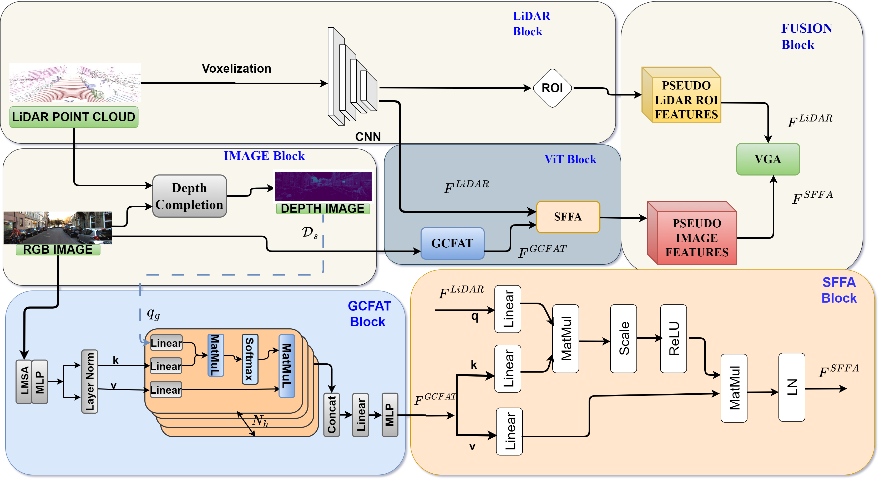

# AYDIV: Adaptable Yielding 3D Object Detection via Integrated Contextual Vision Transformer (ICRA 2024)(Accepted)
<p align="center">  </p>

This is the official implementation of [**AYDIV: Adaptable Yielding 3D Object Detection via Integrated Contextual Vision Transformer**], built on [`Deep Fusion`](https://github.com/tensorflow/lingvo) and [`OpenPCDet`](https://github.com/open-mmlab/OpenPCDet) 

## **Abstract** 
Combining LiDAR and camera data has shown potential in enhancing short-distance object detection in autonomous driving systems. Yet, the fusion encounters difficulties with extended distance detection due to the contrast between LiDAR's sparse data and the dense resolution of cameras. Besides, discrepancies in the two data representations further complicate fusion methods. We introduce AYDIV, a novel framework integrating a tri-phase alignment process specifically designed to enhance long-distance detection even amidst data discrepancies. AYDIV consists of the Global Contextual Fusion Alignment Transformer (GCFAT), which improves the extraction of camera features and provides a deeper understanding of large-scale patterns; the Sparse Fused Feature Attention (SFFA), which fine-tunes the fusion of LiDAR and camera details; and the Volumetric Grid Attention (VGA) for a comprehensive spatial data fusion. AYDIV's performance on the Waymo Open Dataset (WOD) with an improvement of 1.24\% in mAPH value(L2 difficulty) and the Argoverse2 Dataset with a performance improvement of 7.40\% in AP value demonstrates its efficacy in comparison to other existing fusion-based methods.

## **Datasets** ##
|Dataset Name|Link|
|----|----|
|Argoverse 2|[link](https://www.argoverse.org/av2.html#download-link)|
|Waymo open Dataset|[link](https://console.cloud.google.com/storage/browser/waymo_open_dataset_motion_v_1_2_0)|


### **Installation**
1.  Prepare for the running environment. 

    You can use the docker image provided by [`OpenPCDet`](https://github.com/open-mmlab/OpenPCDet). Our experiments are based on the
    docker provided by Voxel-R-CNN and we use NVIDIA Tesla V100 to train our Aydiv.

2. Prepare for the data.

    Convert Argoverse 2 (or) waymo open Dataset into kitti format [`converter`](https://github.com/sanjay-810/AYDIV_ICRA/tree/main/data_converter/convert)

    Please prepare dataset as [`OpenPCDet`](https://github.com/open-mmlab/OpenPCDet).  
    
    To generate depth_pseudo_rgbseguv_twise by yourself with depth_dense_twise as follows:

    ```
    cd Aydiv
    python depth_to_lidar.py
    ```
    
    If you want to generate dense depth maps by yourself, it is recommended to use [`TWISE`](https://github.com/imransai/TWISE). The dense depth maps we provide are generated by TWISE. Anyway, you should have your dataset as follows:

    ```
    Aydiv
    ├── data
    │   ├── waymo_aydiv_seguv_twise
    │   │   │── ImageSets
    │   │   │── training
    │   │   │   ├──calib & velodyne & label_2 & image_2 & (optional: planes) & depth_dense_twise & depth_pseudo_rgbseguv_twise
    │   │   │── testing
    │   │   │   ├──calib & velodyne & image_2 & depth_dense_twise & depth_pseudo_rgbseguv_twise
    ├── pcdet
    ├── tools
    ```
    Each pseudo point in depth_pseudo_rgbseguv_twise has 9 attributes (x, y, z, r, g, b, seg, u, v). It should be noted that we do not use the seg attribute, because the image segmentation results cannot bring improvement to Aydiv in our experiments. Argoverse 2 data should be in same format.

3. Setup.

    ```
    cd Aydiv
    python setup.py develop
    cd pcdet/ops/iou3d/cuda_op
    python setup.py develop
    cd ../../../..
    ```

### Getting Started
1. Training.

    ```
    cd Aydiv/tools
    scripts/dist_train.sh 8 --cfg_file cfgs/waymo_models/aydiv.yaml --gpu_id 0,1,2,3,4,5,6,7
    ```

2. Evaluation.

    ```
    cd Aydiv/tools
    scripts/dist_test.sh 8 --cfg_file cfgs/waymo_models/aydiv.yaml  --gpu_id 0,1,2,3,4,5,6,7 --batch_size 32 \
    --ckpt ../output/waymo_models/aydiv/default/ckpt/checkpoint_epoch_68.pth
    ```

# Who to Contact:
**sanjay bhargav** - sanjay810@iitkgp.ac.in
